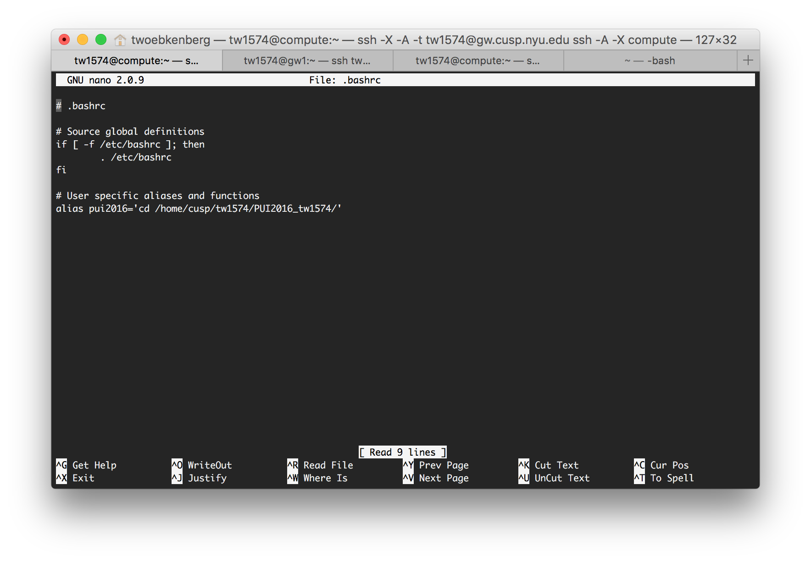
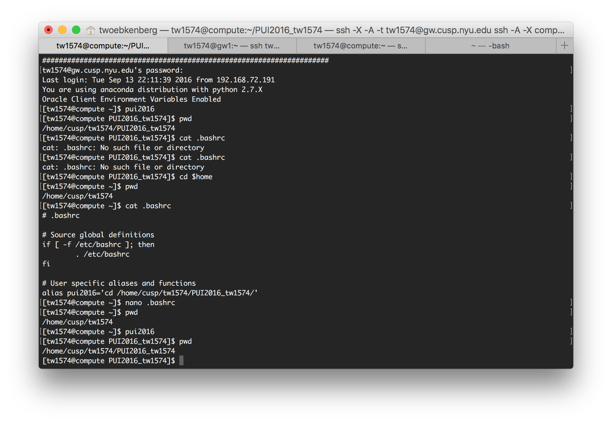

## PUI2016_tw1574
## HW1 - Assignment 1 
### Part 1 - Finish the lab 
For this part of the assignment, I linked my first repository to a directory I created on compute in my home directory and tested out the connection, following the instructions to compare the syncs and any errors generated
### Part 2 - Work on a fork
For this part of the assignment, I worked with Bailey Griswold on our respective repositories and forks of the others so we could work independently on the files.  We tested working on the same file, different line and committing the changes back to the respective repository.

## HW1 - Assignment 2
For this assignment, I created an alias to a newly created directory in my compute home dir
* To do this, I first created the directory (PUI2016_tw1574) using the 'mkdir PUI2016_tw1574' command
* Next I updated my .bashrc file to create the pui2016 alias.  You can see my .bashrc file in the following screenshot

* Then I tested that the alias was successfully added.  I could have just run the 'source .bashrc' command to refresh the .bashrc file, but I just disconnected, and then reconnected to my compute instance using an alias on my local machine.  Then I was able to run the final commands (screenshot below)
 * pwd 
 * pui2016
 * pwd

